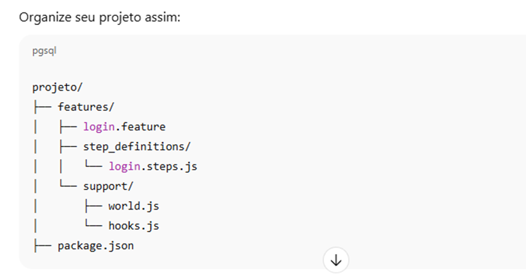

# Automações de Testes Web utilizando Playwright e cucumber

Esse projeto implementa testes de web do cliente Martins Atacado

> Utilizando a stack: Javascript + Cucumber + playwright, esse projeto tem o intuito de implementar a automação de cenários para o projeto SNC (Feature cockpit)


[![playwright Version][playwright-image]]
[![Cucumber Version][cucumber-image]]
[![Javascript Version][javascript-image]]

## Configuração ambiente

1.	Instalar Node.js: acesse o site oficial, baixe e instale a versão para seu computador.
2.	Escolher uma IDE de JavaScript para programar: usaremos o VS Code neste tutorial.
3.	Instalar o Playwright:

```sh
npm install -D @playwright/test@latest
```

4.	Instalar o cucumber:
```sh
npm install --save-dev @cucumber/cucumber
```
## Estrutura pastas:



## Arquitetura do projeto

Toda descrição e explicação sobre a arquitetura do projeto pode ser vista [aqui](https://drive.google.com/file/d/1FOGhn_ZXCh3Zo14zdxE6Wjmgk73Aqt9F/view?usp=drive_link). 


## Execução

Para executar os testes, faça toda a configuração do seu ambiente, e faça o clone do projeto em sua máquina.

execute os comados abaixo:

* Instale a extensão (cucumber (gherkin) Full Support)

* para rodar os testes abrindo o browser rode o comando abaixo:
```
npx cucumber-js --require features ou
npx cucumber-js
```

## Para gerar report rode o comando abaixo apos ter rodado o anterior:
#### OBS: Tem que estar dentro da pasta tests do projeto

## Rode primeiro

```
npx cucumber-js --format json:report.json
```

```
node gerar-report.js
```

## Para rodar os testes abrindo um browser especifico rode o comando abaixo:

## Chrome
```sh
npx cucumber-js --require steps --require support --world-parameters '{"browser": "chromium"}'
```

## Firefox
```sh
npx cucumber-js --require steps --require support --world-parameters '{"browser": "firefox"}'
```

## Webkit (Safari)
```sh
npx cucumber-js --require steps --require support --world-parameters '{"browser": "webkit"}'
```


[javascript-image]: https://img.shields.io/badge/logo-javascript-blue?logo=javascript
[javascript-url]: https://developer.mozilla.org/pt-BR/docs/Web/JavaScript/Guide/Introduction
[cucumber-image]: https://img.shields.io/badge/cucumber-using-brightgreen
[cucumber-url]: https://cucumber.io/
[playwright-image]: https://img.shields.io/badge/playwright-using-brightgreen
[playwright-url]: https://playwright.dev/docs/intro
